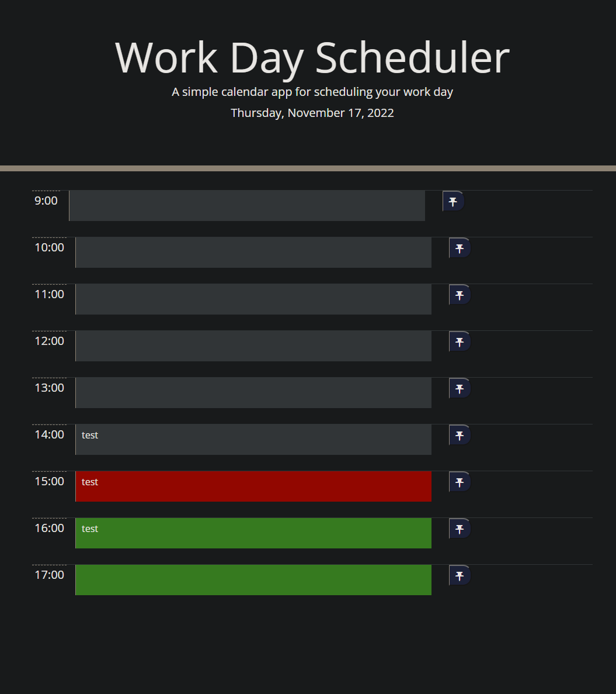

# Work Day Scheduler

## Purpose
A simple scheduler that gives users the capability to enter and save tasks into hourly timeblocks in a standard workday.

## Built With
* HTML
* Javascript
* CSS
* Moment.js library 

## Website
https://wwartick.github.io/Work-Day-Scheduler/

## Screenshot

